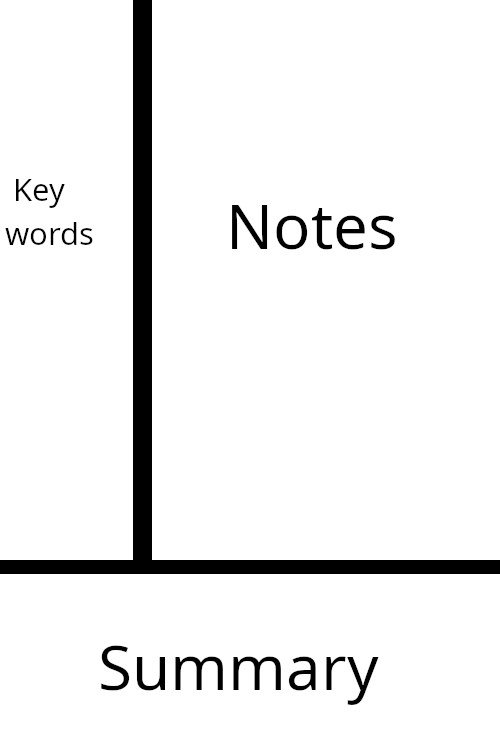

# Study Techniques
With the previous concepts established, it is time to discuss study techniques. The following methods are categorized based on their primary utility

## Understanding

### Elaboration
Elaborative strategies refer to the various ways of connecting prior knowledge with newly acquired information. There are different forms of elaboration, key among which are:

- #### Elaborative Interrogation
Consists of actively asking questions such as "Why?". A meta-analysis found a medium general effect and a high effect size in science learning and a low effect size for English [^1]. One study found that elaborative interrogation improved comprehension; however, it had no effect on retention [^2], while another study showed improved retention for expository texts [^3].

- #### Self-Explanation
Consists of explaining to yourself the information you are learning. A meta-analysis found a moderate effect size on learning [^4]. A systematic review found benefits for procedural and conceptual learning, though effects decrease as information complexity increases and prior knowledge decreases [^5]. Another meta-analysis found a medium effect for mathematics and science and a small effect for English [^1].

### Worked Examples
Worked examples are step-by-step demonstrations of how to solve a problem or task; aim to learn from resources that use them. A meta-analysis found a medium effect on mathematics learning [^6], and a study found that beginners benefited more from combining examples with problem-solving, whereas experienced students benefited more from solving problems alone [^7].

## Retention

### Spaced Retrieval Practice
Spaced retrieval practice consists of repeating the attempt to recall information at gradually increasing intervals. To avoid having to schedule reviews manually, it is recommended to use tools like Anki that natively integrate algorithms like FSRS, which automatically calculate optimal review intervals.
A systematic review and meta-analysis found that spaced retrieval practice moderately improved knowledge retention and acquisition. [^8] Another meta-analysis found that for mathematics the effect on learning was low in mathematics compared to mass practice [^9].

### Interleaved Practice
Consists of alternating the topic or problem type during a study session—for example, instead of solving problems in an A-A-A-B-B-B-C-C-C order, solving them in an A-B-C-A-B-C-A-B-C order.

| Practice Type | Order |
| --- | --- |
| Blocked | A-A-A  B-B-B  C-C-C |
| Interleaved | A-B-C  A-B-C  A-B-C |

A meta-analysis found a medium overall effect for interleaved practice; it also determined that the technique is more effective when the topics or problem types are similar to one another, showing a small positive effect in mathematics and expository texts, but a negative effect on word learning [^10]. One study found similar results in mathematics learning, where students tested one day later showed a moderate effect, while those tested 30 days later showed a large effect [^11]; another study found improvements in retention and physics problem-solving skills [^12].

### Wakeful Rest
the name implies, this involves resting while awake. It is important to note that this differs from meditation; rather than trying to clear your mind of thoughts, you allow your mind to wander. A systematic review and meta-analysis found a medium effect on memory consolidation and noted that factors such as lighting, body position, and whether the eyes were open or closed did not influence the outcome. However, the effect was greater in older adults compared to young adults [^13].

## Questionable Methods

### Highlighting
A meta-analysis found that learner-generated highlighting improved memory but not comprehension, whereas instructor-provided highlighting improved both memory and comprehension. Learner-generated highlighting improved learning in college students but not in primary or secondary education students, while instructor-provided highlighting improved learning for both college and primary/secondary students. The difference regarding whether learner-generated highlighting benefits college students can be explained by their greater experience in determining what is useful and what is not [^14].

### Rereading
In a study, participants read text once, twice with a one-week gap between rereadings, or in a massed manner back-to-back. They were tested either immediately or 2 days after the study session. In the immediate test, massed rereading yielded better performance than reading once, whereas spaced reading was not significantly better than reading once. In the delayed test, performance for spaced reading was superior to reading once, while performance for massed reading and single reading no longer differed significantly [^15].

## Note-Taking

### Format
#### Digital vs. Handwritten
You can take notes in whichever format you prefer. However, it is worth noting that digital note-taking is faster and integrates better with software like Anki. A study found no differences in factual or conceptual recall between laptops, tablets, or handwritten notes [^16].

#### Voice
In a study, voice-based note-taking enabled learners to make more elaborate notes, which improved their comprehension and allowed for greater conceptual understanding [^17]. Another study found similar results, noting higher conceptual understanding and that using voice activated a generative process leading learners to create more elaborate and understandable notes [^18].

### Methods

#### Cornell Notes
Cornell notes involve dividing your page into 3 sections: a left column for keywords and questions, a bottom section for a summary of your notes in your own words, and a right section for main notes.

In one study, the Cornell technique improved retention and confidence while reducing cognitive load when learning English [^19], and in another, it improved reading comprehension [^20] and listening skills [^21].

## References

[^1]: https://doi.org/10.3389/feduc.2021.581216
[^2]: https://doi.org/10.25777/fhnx-9983
[^3]: https://doi.org/10.1037/0022-0663.96.3.437
[^4]: https://summit.sfu.ca/_flysystem/fedora/2025-07/etd21092.pdf
[^5]: https://doi.org/10.1080/0020739X.2025.2556867
[^6]: https://doi.org/10.1007/s10648-023-09745-1
[^7]: https://doi.org/10.58459/icce.2013.17
[^8]: https://doi.org/10.1016/j.nedt.2026.107285
[^9]: https://doi.org/10.1007/s10648-025-10035-1
[^10]: https://doi.org/10.1037/bul0000209
[^11]: http://doi.org/10.1037/edu0000001
[^12]: https://doi.org/10.1038/s41539-021-00110-x
[^13]: https://doi.org/10.3758/s13423-025-02665-x
[^14]: https://doi.org/10.1007/s10648-021-09654-1
[^15]: https://doi.org/10.1037/0022-0663.97.1.70
[^16]: https://doi.org/10.3352/jeehp.2022.19.8
[^17]: https://doi.org/10.48550/arXiv.2012.02927
[^18]: https://doi.org/10.1145/3491102.3501974
[^19]: https://doi.org/10.1186/s40862-025-00347-8
[^20]: https://doi.org/10.56209/badi.v1i1.25
[^21]: https://doi.org/10.17507/tpls.1408.10
