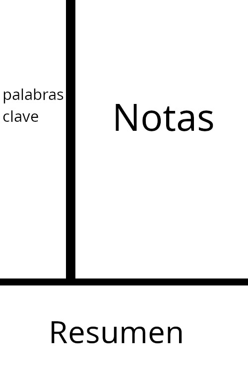

# Técnicas de estudio
Ya con los anteriores conceptos establecidos, es momento de hablar sobre las técnicas de estudio, los siguientes métodos están ordenados en categorías según su utilidad principal 

## Entendimiento
### Elaboración
Las estrategias de elaboración se refieren a las diversas formas de conectar los conocimientos previos con lo que se acaba de aprender, hay distintas formas de elaboración, de las cuales destacan:

- #### Elaboración interrogativa
Consiste en preguntar preguntas del estilo: "¿Porqué?". Un metaanálisis encontró un efecto alto en el aprendizaje de ciencias y uno medio para inglés [^1]. Un estudio encontró que la elaboración interrogativa mejoró la comprensión, sin embargo, no tuvo efecto en la retención [^2] y en otro estudio mejoró la retención de textos expositivos [^3].

- #### Auto explicación    
Consiste en indicar o escribir un concepto con tus propias palabras. Un metaanálisis encontró un efecto moderado en el aprendizaje [^4]. Una revisión sistemática encontró los beneficios en el aprendizaje procedimental y conceptual, los efectos disminuyen conforme aumenta la complejidad de la información y disminuye el conocimiento previo [^5]. Y un metaanálisis encontró un efecto medio para matemáticas y ciencias y uno pequeño para inglés [^1].

### Ejemplos resueltos
Los ejemplos resueltos son ejemplos paso a paso de cómo resolver un problema o tarea, trata de aprender de recursos que los utilicen. Un metaanálisis encontró un efecto medio en el aprendizaje de matemáticas [^6] y un estudio encontró que los principiantes se beneficiaban más de combinar los ejemplos con problemas y los estudiantes experimentados se beneficiaban más de solo resolver problemas [^7].

## Retención 
### Práctica de recuperación espaciada  
La práctica de recuperación espaciada consiste en repetir de forma gradualmente más espaciada el intento de evocar información. Para evitar tener que programar las revisiones de forma manual, es recomendable usar herramientas como Anki que integran de forma nativa algoritmos como FSRS que calculan automáticamente los intervalos óptimos de revisión.
Una revisión sistemática y metaanálisis encontró que la práctica de recuperación espaciada mejoraba la retención y adquisición de conocimiento. [^8] Otro metaanálisis encontró que para matemáticas el efecto en el aprendizaje era bajo a medio [^9].

### Práctica intercalada
Consiste en alternar el tema o tipo de problema durante la sesión de estudio, por ejemplo, en vez de resolver problemas en un orden A-A-A-B-B-B-C-C-C, se resuelven en el orden A-B-C-A-B-C-A-B-C.

| Tipo de práctica | Orden                       |
| ---------------- | --------------------------- |
| bloques          | A-A-A   B-B-B   C-C-C |
| intercalada      | A-B-C   A-B-C   A-B-C |

Un metaanálisis encontró que la práctica intercalada es más efectiva cuando los temas o tipos de problema son similares entre sí, con un efecto positivo pequeño en matemáticas y un efecto negativo en el aprendizaje de palabras y textos expositivos [^10]. Un estudio encontró resultados similares en el aprendizaje de matemáticas [^11] y en otro se mejoró la retención y habilidad de resolver problemas de física [^12].

### Descanso en vigilia
Consiste, como su nombre lo indica, en descansar mientras estás despierto, cabe aclarar que es diferente a la meditación, ya que no estás tratando de pensar en nada y, en cambio, dejas a tu mente divagar. Una revisión sistemática y metaanálisis encontró un efecto significativo en la consolidación de la memoria y mencionó que los siguientes factores no influyen en el efecto: luz, posición corporal y si los ojos estaban cerrados o abiertos. Sin embargo, el efecto fue mayor en adultos mayores comparado con adultos jóvenes. [^13]

## Métodos Cuestionables

### Resaltar con marca textos
un meta-análisis encontró que un resaltado generado por el aprendiz mejoraba la memoria, pero no la comprensión y que un resaltado generado por el instructor mejoraba tanto la memoria como la comprensión, un resaltado generado por el aprendiz mejoraba el aprendizaje en estudiantes de universidad, pero no para en estudiantes de educación básica y media y un resaltado generado por el instructor mejoraba el aprendizaje tanto para estudiantes universitarios como de educación básica y media, la diferencia entre sí el resaltado generado por estudiantes universitarios mejora el aprendizaje puede explicarse a que los estudiantes universitarios tienen mayor experiencia para determinar que es útil y que no [^14]

### Relectura
en un estudio los participantes leyeron una vez, dos veces con una separación de una semana entre la relectura y de manera masiva después y tuvieron una prueba inmediatamente o 2 días después de la sesión de estudio en la prueba inmediata la relectura en masa tuvo mejor rendimiento que leer solo una vez mientras que la lectura distribuida no fue significativamente mejor que leer una vez y en una prueba retrasado el rendimiento para la lectura distribuida fue mejor que leer una vez mientras que el rendimiento para la lectura en masa y leer una vez ya no se diferenciaban significativamente [^15]

## Toma de notas
### De que forma
#### Digital o a Mano
Puedes escribir de la forma que más te agrade, aunque cabe mencionar que la escritura digital es más rápida y tiene mejor integración con software como Anki, un estudio no encontró diferencias entre la retención factual o conceptual entre laptops, tablets o notas a mano [^16].
#### Voz
En un estudio, la toma de notas por medio de la voz permitió que los aprendices hicieran mayores elaboraciones, esto mejoró su comprensión y puede permitir a los estudiantes un mayor entendimiento conceptual. [^17] Otro estudio encontró resultados similares, mencionando un mayor entendimiento conceptual y que el uso de la voz activaba un proceso generativo que resultaba en que los aprendices tomaran notas más elaboradas y comprensibles. [^18]

### Metodos

#### Notas Cornell 
Las notas Cornell consisten en dividir tu hoja en 3 secciones: una sección a la izquierda donde se deben anotar palabras y preguntas clave, y una sección inferior donde se escribe un resumen de tus notas en tus propias palabras y, finalmente, una sección en la parte derecha donde se escriben las notas. 

En un estudio, la técnica Cornell mejoró la retención y confianza, además de reducir la carga cognitiva al momento de aprender inglés [^19], y en otro mejoró la comprensión lectora [^20] y el listening [^21]

## Referencias

[^1]: https://www.frontiersin.org/journals/education/articles/10.3389/feduc.2021.581216/full
[^2]: https://digitalcommons.odu.edu/cgi/viewcontent.cgi?article=1049&context=teachinglearning_etds
[^3]: https://www.researchgate.net/profile/John-Guthrie-4/publication/232434222_Interactions_Among_Elaborative_Interrogation_Knowledge_and_Interest_in_the_Process_of_Constructing_Knowledge_From_Text/links/54aea39a0cf2b48e8ed45504/Interactions-Among-Elaborative-Interrogation-Knowledge-and-Interest-in-the-Process-of-Constructing-Knowledge-From-Text.pdf
[^4]: https://summit.sfu.ca/_flysystem/fedora/2025-07/etd21092.pdf
[^5]: https://www.tandfonline.com/doi/pdf/10.1080/0020739X.2025.2556867
[^6]: https://www.danamillercotto.com/uploads/4/7/7/2/47725475/barbieri_et_al__2023__we_meta-analysis.pdf
[^7]: https://library.apsce.net/index.php/ICCE/article/view/17
[^8]: https://www.sciencedirect.com/science/article/abs/pii/S0260691726003138?via%3Dihub
[^9]: http://www.aidanhorner.org/papers/Murrayetal_EdPsychReview_2025.pdf
[^10]: https://www.uni-wuerzburg.de/fileadmin/06020400/2019/Brunmair_Richter_in_press__2019_META-ANALYSIS_OF_INTERLEAVED_LEARNING.pdf
[^11]: https://pdfs.semanticscholar.org/4859/333b951b89580e0f609d912a7982c377af74.pdf
[^12]: https://www.nature.com/articles/s41539-021-00110-x.pdf
[^13]: https://pubmed.ncbi.nlm.nih.gov/40087245/
[^14]: https://www.researchgate.net/profile/Hector-Ponce-3/publication/357668403_Effects_of_Learner-Generated_Highlighting_and_Instructor-Provided_Highlighting_on_Learning_from_Text_A_Meta-Analysis/links/692e377e1a621a227cf71fa4/Effects-of-Learner-Generated-Highlighting-and-Instructor-Provided-Highlighting-on-Learning-from-Text-A-Meta-Analysis.pdf
[^15]: https://psycnet.apa.org/record/2005-01890-007
[^16]: https://www.semanticscholar.org/paper/No-difference-in-factual-or-conceptual-recall-for-a-Wiechmann-Edwards/753833d1defeed034df2191dcc767a5236bc2474
[^17]: https://www.semanticscholar.org/reader/92d650199edc0d27bccad94cb6b62de3143857da
[^18]: https://dl.acm.org/doi/10.1145/3491102.3501974
[^19]: https://link.springer.com/article/10.1186/s40862-025-00347-8#Sec20
[^20]: https://celebesscholarpg.com/index.php/bataradidi/article/view/25
[^21]: https://tpls.academypublication.com/index.php/tpls/article/view/8509